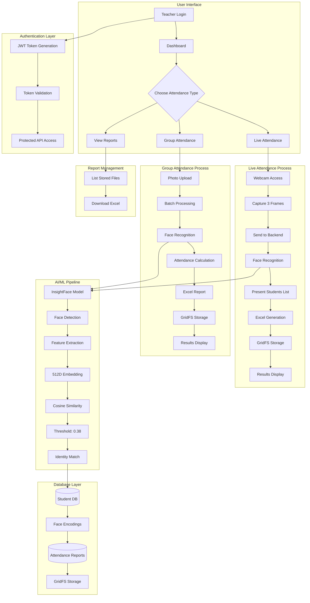
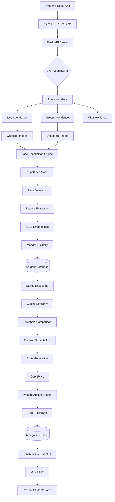
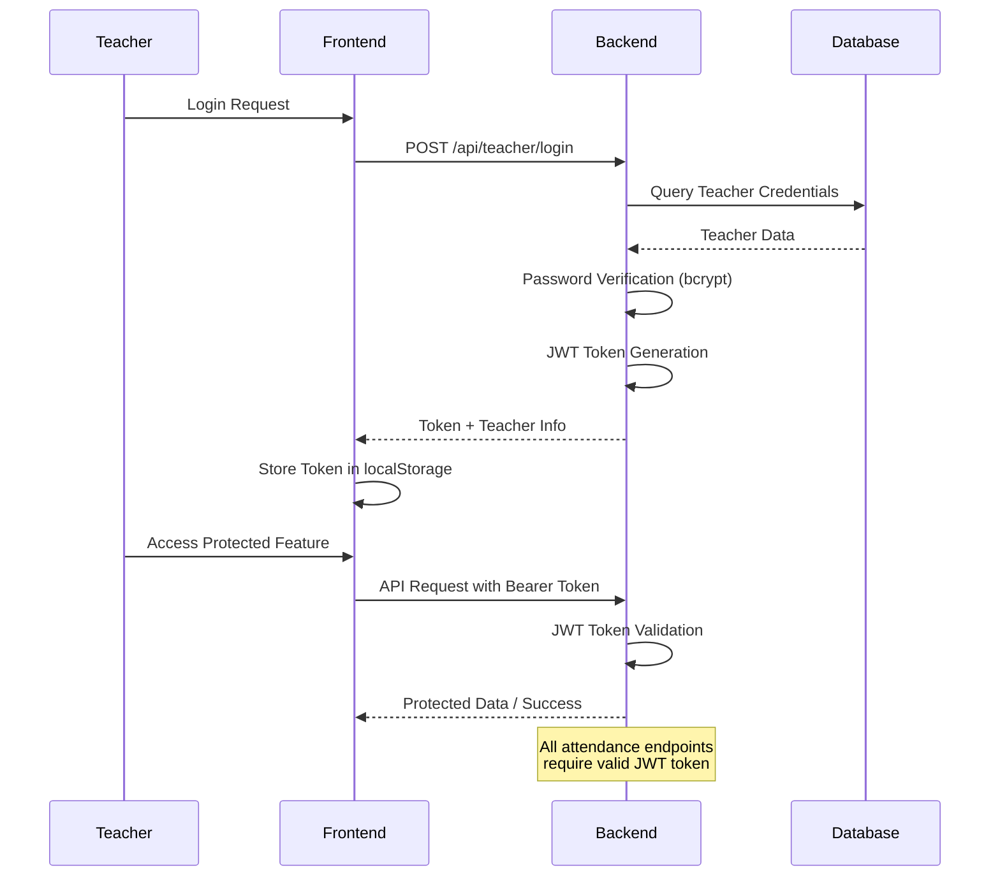
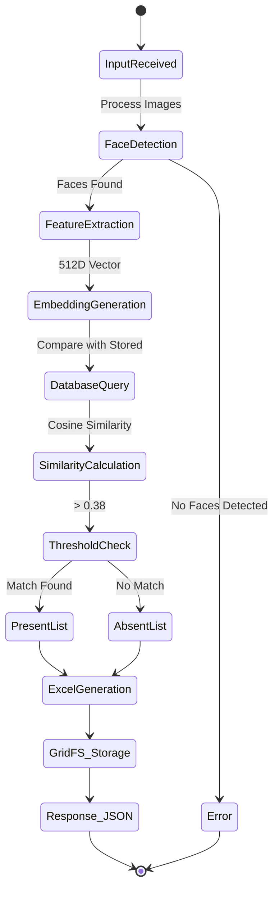
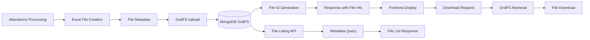
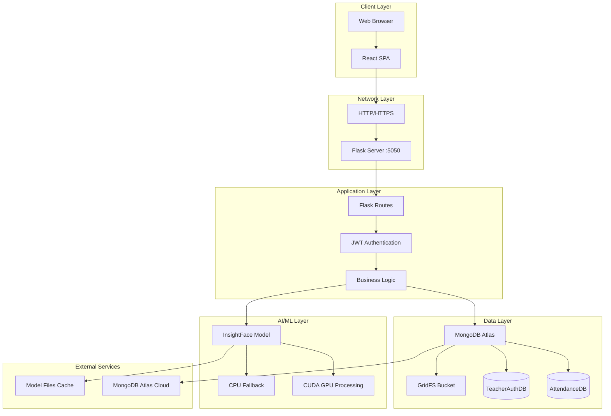
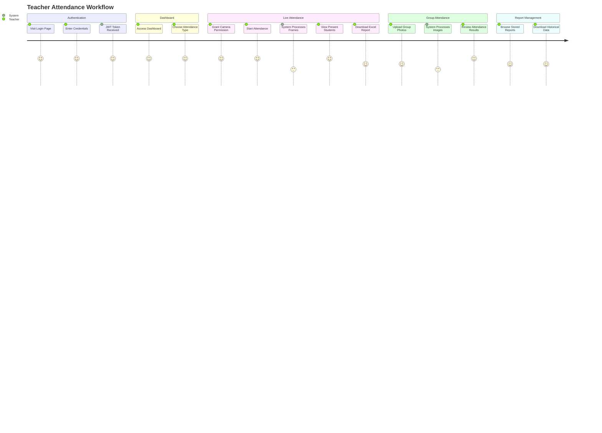

# Attendance System Workflow Diagrams

## 🔄 Complete System Workflow

## 📊 Data Flow Architecture

## 🔐 Authentication & Security Flow

## 🎯 Attendance Processing Flow

## 🗂️ File Management Workflow

## 🚀 Deployment Architecture

## 📱 User Journey Map

This comprehensive workflow documentation provides a complete view of the attendance system's architecture, data flow, and user interactions.